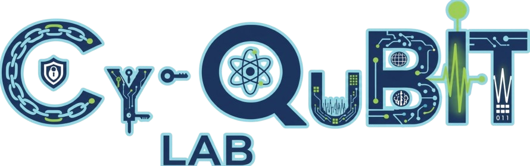
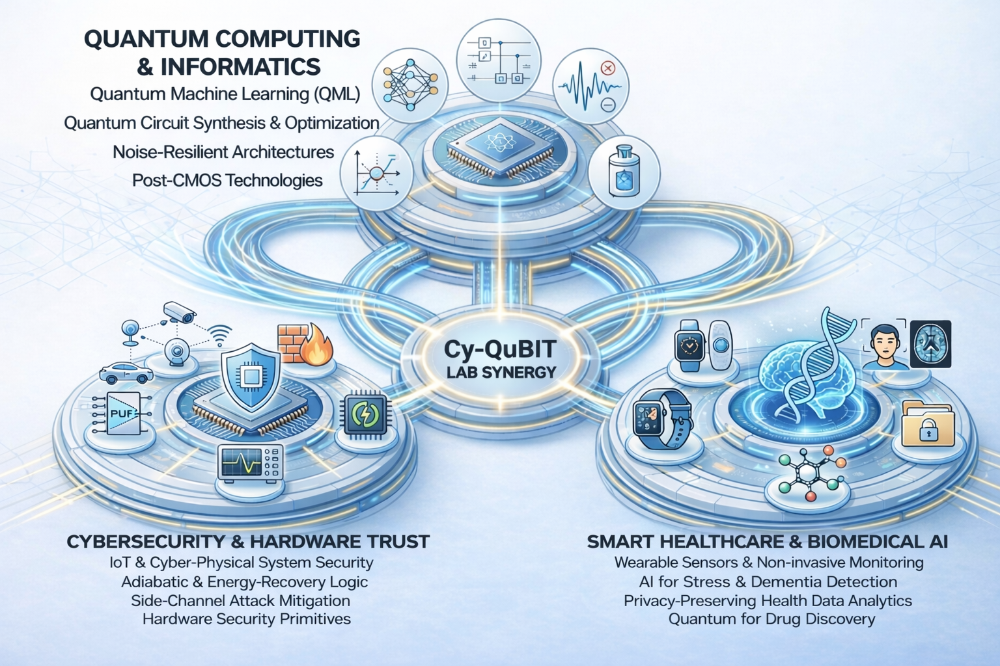

## Hi there 👋

    

Welcome to **Cyqubit Lab** — the Cybersecurity and Quantum Biomedical Interdisciplinary Technologies Lab!

Cyqubit Lab is a research group focused on advancing the intersection of *quantum computing*, *cybersecurity*, and *biomedical systems*. Our mission is to explore fundamental and applied problems that arise at the crossroads of these fields, bringing together cutting-edge methods from quantum information science and secure computing to address real-world challenges.

    

### 🔬 What We Do

- Conduct interdisciplinary research in **quantum computing**, **cybersecurity**, and **biomedical technologies**.
- Publish and disseminate high-impact research findings and technical advancements.
- Engage with the broader scientific community through media coverage, conference roles, and collaborative projects.

### 📢 Leadership

**Dr. Himanshu Thapliyal** leads Cyqubit Lab and has made significant contributions in quantum computing, cybersecurity of cyber-physical systems, and emerging technologies. Dr. Thapliyal’s work includes high profile roles in professional societies and editorial boards in related fields.

### 🧪 Research

The **Cy-QuBIT Lab** conducts interdisciplinary research at the intersection of quantum computing, cybersecurity, and machine learning. Current research themes include: 

> #### 🛠️ Quantum Design Automation
In the Cy-QuBIT lab we are advancing tools and algorithms that address core challenges in quantum circuit design and synthesis. Our [Peephole Optimization for Quantum Approximate Synthesis](https://github.com/Cy-QuBIT/quant-peep-approx) project develops techniques to improve quantum circuit approximations with better error resilience and quality of results by refining recombination and mapping stages within synthesis pipelines. Complementing this, the [Greedy Topology-Aware Quantum Circuit Partitioning (GTQCP)](https://github.com/Cy-QuBIT/quant-gtqcp) work explores efficient heuristics for cutting larger circuits into smaller, more manageable pieces based on qubit dependency graphs, improving runtime and partition quality compared to existing partitioners. Finally, the [Tree-based Directed Acyclic Graph (TDAG) partitioning](https://github.com/Cy-QuBIT/quant-tdag) project investigates new ways to represent and split quantum circuits as binary tree structures, aiming to cut execution time and maintain high fidelity of sub-circuits for downstream compilation and optimization. Together, these efforts push the boundaries of quantum design automation by making synthesis, partitioning, and optimization more scalable and effective for near-term quantum systems.

> #### 🔍 Quantum Architectures and Machine Learning for Cyber Defense
Our lab develops quantum computing methods that improve both security and reliability in the NISQ era. We advance distributed quantum computing using Residue Number System based modulo adders to reduce circuit depth, improve noise resilience, and strengthen resistance to crosstalk-based attacks, supported by our QSMART tool that generates optimized RNS adder sets based on design goals like depth and efficiency. In parallel, we apply quantum and hybrid quantum machine learning to cybersecurity problems, including anomaly detection for cyber-physical control systems and detecting data tampering in healthcare sensor streams. Across these efforts, we focus on practical, high-impact quantum techniques that make next-generation computing systems more trustworthy.

> #### 📊 Machine Learning for Stress Detection and Prediction  
We explore stress prediction in older adults using behavioral time-series sensor data (electrodermal activity, blood volume pulse, skin temperature) combined with recurrent neural networks (RNNs) and long short-term memory (LSTM) models. This work investigates relationships between multi-modal sensor inputs and cortisol biomarkers to forecast stress levels proactively.

> #### ⚙️ Secure FPGA Design with MTJ/CMOS  
Focusing on hardware security, work is underway to design low-power, CPA-resistant configurable logic blocks (CLBs) by integrating magnetic tunnel junction (MTJ) devices with CMOS. These CLBs target secure, energy-efficient FPGA architectures suitable for IoT and embedded applications.

> #### ⚡ Energy-Efficient STT-MRAM Writing Circuitry  
Research develops novel designs for energy-efficient write circuits for spin transfer torque magnetic RAM (STT-MRAM). By combining sinusoidal power clocking with efficient control logic, these circuits show significant energy savings over traditional designs.

> #### 🛠️ Automated Generation of Dual Rail Adiabatic Gates  
This project focuses on secure adiabatic circuit synthesis using binary decision diagrams (BDDs) to create dual-rail adiabatic logic, which offers improved resistance to side-channel attacks like differential power analysis.

> #### 🤖 Quantum Machine Learning for Consumer Electronics  
Exploring quantum machine learning methodologies for anomaly detection in consumer electronics systems, this effort highlights frameworks and case studies demonstrating QML’s potential in cybersecurity and threat detection tasks.

### 📄 News & Media

We share updates about lab achievements, ongoing research projects, and external recognitions on our website and through academic and industry outlets. Notable items include media coverage and conference leadership.

### 🤝 Contributing

We welcome contributions from students, researchers, and collaborators interested in advancing interdisciplinary research in quantum computing, cybersecurity, and biomedical technologies.

To contribute:

- Check each repository’s **CONTRIBUTING.md** for guidelines.
- Open an issue to start a discussion.
- Submit a pull request for review.

#### 👥 Current Lab Members

These are the current members of **Cy-QuBIT Lab** as listed on the lab website:

- **Wu Yang** — Ph.D. student researching low-energy secure memory circuits and emerging computing. 
- **Joseph Clark** — Ph.D. candidate researching design automation, embedded systems, and quantum computing.
- **Md Saif Hassan Onim** — Ph.D. candidate working on adversarial AI, machine learning, and quantum machine learning in healthcare.
- **Milad Tanavardi Nasab** — Ph.D. student focusing on VLSI design, emerging technologies, and hardware security.
- **Sounak Bhowmik** — Ph.D. student specializing in quantum information, quantum machine learning, and QML security.
- **Austin Cambell Jerrolds** — MS student with research interests in embedded systems and FPGAs.

### 📎 Useful Links

- 🌐 Lab Website: https://www.cy-qubit.site/cy-qubitlab
- 📚 Publications & Research Profiles (linked on site)

---

Thanks for checking out Cyqubit Lab! We’re excited to build, share, and collaborate with the community. 🚀
